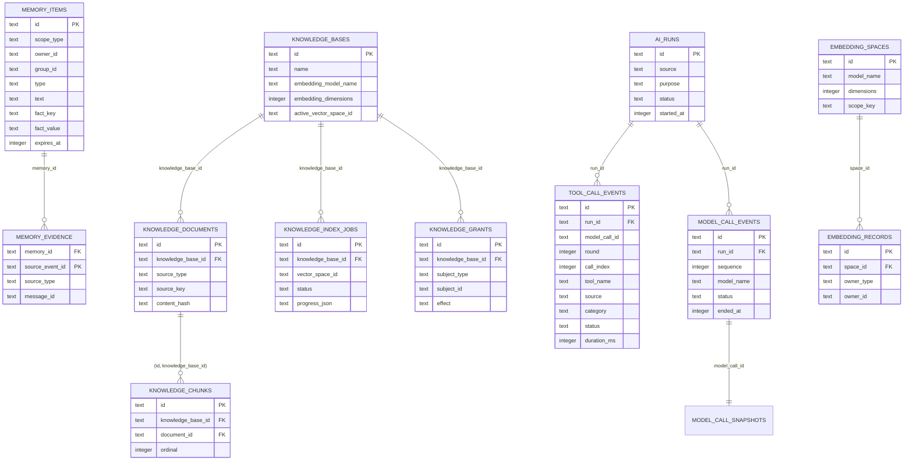
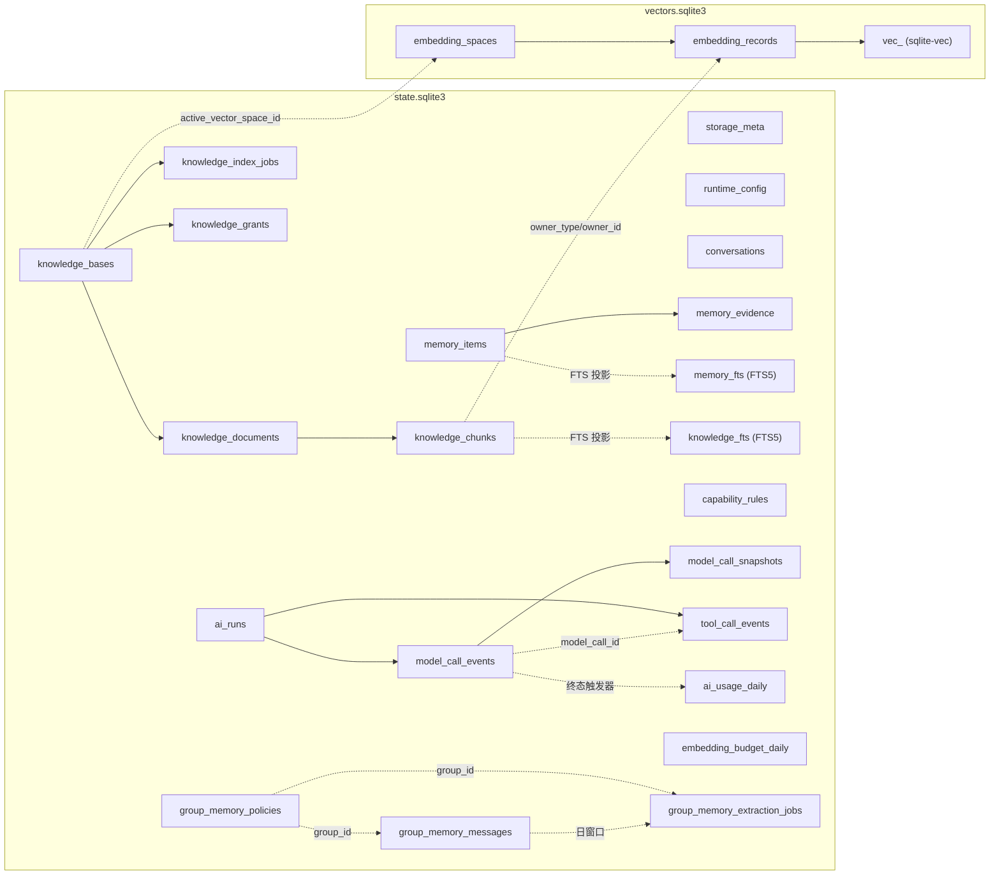

# SQLite 从 0 开始基线

本项目的 SQLite 结构从 `001-baseline.sql` 基线开始，状态库继续执行 `002-tool-call-events.sql` 和 `003-model-call-snapshots.sql`：前者包含工具事件、群记忆召回和工具链父子关系，后者把每次实际模型请求的脱敏上下文、模型可见工具定义和请求元数据独立保存，供管理台详情窗口按需读取；向量库仍使用自己的基线。无法识别的历史迁移记录或旧表会被拒绝，迁移在 Worker 内事务执行并保留失败现场。运行、模型调用和工具调用的父级引用支持子代理、工具派生模型调用和后台完成事件的拓扑追踪，会话详情按 `conversation_key` 汇总全部保留的顶层轮次，模型快照请求元数据中的上下文分组用于显示每条消息的来源。

## ER 图

实线是数据库外键；虚线是同库内的投影或以业务键关联的关系（不以外键强制）。`memory_fts`、`knowledge_fts` 和每个 `vec_<space>` 均是可重建索引。

## 全表清单

| 数据库 | 表 | 职责 | 关键列 |
| --- | --- | --- | --- |
| state | `storage_meta` | 存储元信息 | `key`, `value`, `updated_at` |
| state | `runtime_config` | 单行运行配置覆盖 | `id=1`, `schema_version`, `revision`, `overrides_json` |
| state | `conversations` | 临时对话历史 | `conversation_key`, `history_json`, `expires_at` |
| state | `memory_items` | 长期事实、画像、群提炼结果 | 作用域、正文、事实键值、状态、过期时间 |
| state | `memory_evidence` | 记忆的最小证据引用 | `memory_id`, `source_event_id`, `source_type`, `message_id` |
| state | `memory_fts` | 记忆 FTS5 投影 | `memory_id`, `text` |
| state | `knowledge_bases` | 知识库设置与当前向量空间 | 模型、维度、检索设置、`active_vector_space_id` |
| state | `knowledge_documents` | 直接归属知识库的文档 | `source_type`, `source_key`, 标题、正文、哈希 |
| state | `knowledge_chunks` | 文档分块 | 文档/知识库复合外键、序号、正文、哈希 |
| state | `knowledge_fts` | 知识分块 FTS5 投影 | `chunk_id`, `knowledge_base_id`, 标题、正文 |
| state | `knowledge_index_jobs` | 向量重建任务与进度 | `vector_space_id`, 状态、尝试、`progress_json` |
| state | `capability_rules` | 工具/能力授权规则 | 主体、资源、allow/deny |
| state | `knowledge_grants` | 知识库授权规则 | 知识库、主体、群域、allow/deny |
| state | `ai_runs` | 一轮模型工作的汇总 | `parent_run_id`, 来源、用途、作用域、用量、成本、状态 |
| state | `model_call_events` | 实际模型调用明细 | `run_id`, `parent_tool_id`, 序号、模型、用量、输入审计、错误 |
| state | `model_call_snapshots` | 模型请求详情快照 | `model_call_id`, 上下文 JSON、工具定义 JSON、含上下文来源分组的请求元数据、截断标记 |
| state | `tool_call_events` | 每次实际工具执行明细 | `run_id`, `model_call_id`, `parent_tool_id`, 轮次、工具、状态、耗时、参数与结果摘要 |
| state | `ai_usage_daily` | 日级模型用量汇总 | 日期、模型、用途、用量、调用数、成本 |
| state | `embedding_budget_daily` | Embedding 日预算账本 | 日期、模型、用途、预估 token、调用数 |
| state | `group_memory_policies` | 按群的采集策略 | `group_id`、继承覆盖、保留期、提炼设置与记忆召回条数 |
| state | `group_memory_messages` | 指定群的原始消息 | `group_id + message_id`、消息段、哈希、过期时间 |
| state | `group_memory_extraction_jobs` | 群消息自然日提炼任务 | `group_id`、窗口、进度、结果、重试状态 |
| vectors | `embedding_spaces` | 向量空间定义 | 模型、维度、距离度量、`scope_key` |
| vectors | `embedding_records` | 向量所有者元数据 | 空间、所有者类型/ID、内容哈希 |

## 有意移除的过渡结构

- 会话拆表：`conversation_messages`、`conversation_turns`、`conversation_usage`、`conversation_tool_calls`；现由单个 `conversations.history_json` 承担短期历史。
- 知识源和 generation 中间层：`knowledge_sources`、`knowledge_index_generations` 及其子表；文档直接带 `source_type/source_key`，新向量空间完成后再原子切换 `active_vector_space_id`。
- 人格持久化表：人物行为只由运行配置驱动，不保留独立 profile/binding 表。
- 工具调用与用量事件流水：旧版 `ai_usage_events` 不再使用；当前工具执行明细统一由 `tool_call_events` 保存，模型用量由 `model_call_events` 和日汇总保存。
- 群采集的泛化 scope、来源适配器和小时分窗列；第一版只支持 `group_id` 和自然日提炼窗口。
