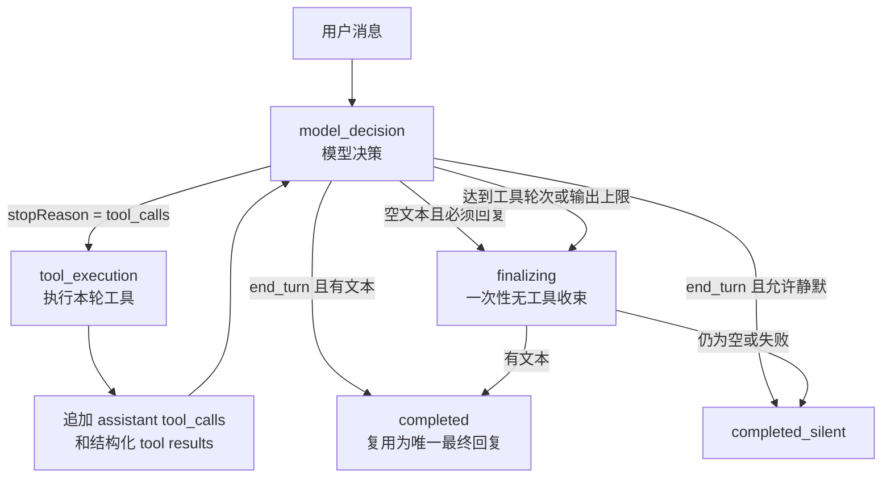

# AI Tool 创建与集成指南

本文供维护者和代码 AI 创建、修改 Yui Chat 工具时使用。开始编码前应完整阅读本文，并以以下源码为最终事实来源：

- 公共类型：`tools/support/tool-contract.ts`
- 归一化与参数校验：`tools/support/contract.ts`
- 注册与调用边界：`tools/support/registry.ts`
- 单次请求的 Agent Loop：`core/chat/agent-turn-state.ts`、`core/chat/model-step-executor.ts`
- 次数、重试与副作用账本：`tools/support/execution-runtime.ts`
- 模型结构化终止状态：`models/protocol/types.ts`、`models/protocol/normalize.ts`
- 结构化消息和工具结果：`core/message-chain/types.ts`
- 内置工具目录：`tools/builtins/index.ts`

## 1. 先确定工具形态

| 需求 | 选择 | 主要位置 |
| --- | --- | --- |
| 插件核心能力，需要复用内部模块 | Builtin Tool | `tools/builtins/` |
| 用户可安装、启停和编辑的独立扩展 | Custom Tool | `data/yui-chat/extensions/tools/<id>/` |
| 能力已由外部 MCP 服务提供 | MCP Tool | MCP 配置，不复制一份本地实现 |
| 只需要给模型提供方法和规则，不执行代码 | Skill | `skills/`，不要伪装成 Tool |

不要绕过 `toolRegistry` 直接调用工具实例。不要为新工具保留旧名称别名；只有已经存在外部导入时才考虑兼容转发。

## 2. 最小工具结构

内置工具可以使用类，也可以返回普通对象。最终都必须能被 `normalizeTool()` 归一化：

```ts
import type { ToolExecutionContext } from "../support/tool-contract.js"

type Args = Record<string, unknown>

export class ExampleLookupTool {
  name = "example_lookup"
  source = "builtin"
  description = "Look up one example record. Use it when the user asks for current example data."
  tags = ["lookup", "example"]
  execution = {
    effect: "read",
    repeatPolicy: "bounded",
    retryPolicy: "safe",
    maxAttempts: 2,
    parallelSafe: true,
  }
  parameters = {
    type: "object",
    properties: {
      query: { type: "string", minLength: 1, description: "Lookup keyword." },
      limit: { type: "integer", minimum: 1, maximum: 10, description: "Maximum records. Defaults to 5." },
    },
    required: ["query"],
  }

  async execute(args: Args = {}, context: ToolExecutionContext = {}) {
    const query = String(args.query || "").trim()
    const limit = Math.max(1, Math.min(Number(args.limit || 5), 10))
    const rows = await lookup(query, { limit, signal: context.agent?.signal })
    return { query, results: rows }
  }
}
```

在对应的 `create*Tools()` 中返回实例；新增内置分类时才修改 `tools/builtins/index.ts`。工具还必须进入相关默认工具集、权限配置或预设，否则注册成功也可能不会注入模型。

## 3. 公共字段

所有字段在归一化后进入 `ToolCommon`。没有明确需求时使用最小声明，不复制默认值。

| 字段 | 是否必需 | 含义与建议 |
| --- | --- | --- |
| `name` | 是 | 全局唯一的 `snake_case` 名称，简短表达动作与对象。 |
| `description` | 是 | 模型选择工具的主要依据；说明何时调用、何时不要调用、关键默认行为。避免宣传文案。 |
| `displayNameZh` | 否 | 管理台中文名称；内置工具也可由公共映射推导。 |
| `source` | 是 | `builtin`、`custom`、`mcp`、`skill` 或 `system`；通常由注册入口补齐。 |
| `category` | 否 | `network`、`media`、`admin` 等；内置分组会补齐。 |
| `tags` | 否 | 用于工具筛选和搜索意图识别，保持少量稳定词。 |
| `risk` | 否 | `low`、`medium`、`high`、`external`。高风险工具必须配权限。 |
| `policy` | 否 | 权限和边界声明，例如 `requiresMaster`、`requiresGroup`、`requiresGroupAdmin`、`externalNetwork`。 |
| `parameters` | 是 | 发给模型的调用参数 JSON Schema。只放模型需要决定的输入。 |
| `configSchema` | 否 | 管理员运行配置 Schema；值经 `context.toolConfig` 注入，不发送给模型。密钥必须标记 `secret: true`。 |
| `delivery` | 否 | `silent`、`current-chat`、`target-chat`、`media`。普通观察工具保持默认 `silent`。 |
| `requiresFinalReply` | 否 | 默认 `true`。后台任务、已经完成即时动作且不需模型续答的工具才设为 `false`。 |
| `autoDelivery` | 否 | 自动把工具生成的媒体计划交给 `message_send`；默认空，详见第 7 节。 |
| `execution` | 建议 | 基础执行策略，必须与真实副作用一致。 |
| `executionByAction` | 否 | 复合工具按 `args.action` 覆盖执行策略。 |
| `hiddenFromModel` | 否 | 仅内部调用且不允许模型选择时使用。 |
| `pipeline` | 否 | 仅现有输入/输出管线工具使用，不为普通工具新增第二套机制。 |

## 4. 参数设计

`parameters` 使用 JSON Schema 的常用子集。当前运行时校验：

- 类型：`object`、`array`、`string`、`number`、`integer`、`boolean`、`null`
- 枚举：`enum`
- 必填：`required`
- 字符串：`minLength`、`maxLength`
- 数字：`minimum`、`maximum`
- 数组：`minItems`、`maxItems`、`items`
- 对象：`properties`

推荐规则：

1. 参数名保持稳定、明确，不使用 `data`、`value` 之类无法判断语义的泛名。
2. 在 Schema 中声明真实默认值，同时在 `execute()` 中实现相同默认值。
3. `action` 适合合并紧密相关的读写操作；无关操作应拆成工具。
4. 资源参数使用完整结构，不把数组下标、描述文字或临时 ID 当作 URL。
5. 不把管理员密钥放进 `parameters`；应放入 `configSchema`。
6. 参数越多，模型定义 Token 越高。只暴露模型真正需要选择的字段。

示例：

```ts
parameters = {
  type: "object",
  properties: {
    action: {
      type: "string",
      enum: ["search", "send"],
      default: "send",
      description: "Defaults to send. Use search only to list candidates without delivery.",
    },
    query: { type: "string", minLength: 1, maxLength: 200, description: "Search keywords." },
    count: { type: "integer", minimum: 1, maximum: 5, default: 1, description: "Number of results to send." },
  },
  required: ["query"],
}
```

## 5. 执行策略

### `effect`

| 值 | 使用场景 |
| --- | --- |
| `read` | 只读取，不改变外部状态；默认可安全并行。 |
| `idempotent_write` | 重复执行得到相同状态，例如写缓存或设置固定值。 |
| `non_idempotent` | 发送消息、点赞、戳一戳等每次都会产生新效果。 |
| `destructive` | 删除、踢人、撤回等难恢复操作。 |
| `unknown` | 无法确认外部 MCP/Custom 工具副作用时使用；策略会偏保守。 |

### 重复、重试和派发

| 字段 | 可选值 | 要点 |
| --- | --- | --- |
| `repeatPolicy` | `allow`、`bounded`、`dedupe`、`explicit_only` | 读操作通常 `bounded`；普通副作用通常 `dedupe`；只有用户明确次数才重复的动作使用 `explicit_only`。 |
| `retryPolicy` | `safe`、`executor`、`no_ambiguous_retry`、`none` | 读操作可 `safe`；非幂等副作用通常 `no_ambiguous_retry`。 |
| `dispatchMarking` | `immediate`、`deferred` | 默认进入执行边界即标记；需要先校验/准备、真正调用宿主前才算派发时使用 `deferred` 并调用 `context.execution.markDispatched()`。 |
| `parallelSafe` | boolean | 只有确定无共享可变状态的读取才能开启。 |
| `maxAttempts` | 1–5 | 读取一般 2；副作用一般 1。 |
| `timeoutMs` | 1000–600000 | 工具级总超时；网络调用仍应接收取消信号并使用更短的客户端超时。 |

支持显式次数的工具还应声明：

```ts
execution = {
  effect: "non_idempotent",
  repeatPolicy: "explicit_only",
  retryPolicy: "no_ambiguous_retry",
  supportsCount: true,
  countField: "count",
  maxCount: 5,
  targetFields: ["userId"],
  operationFields: ["userId", "action"],
  operationFamily: "example_action",
  promptCount: { keywords: ["执行", "操作"], units: ["次", "下"], maxClauses: 4 },
}
```

`supportsCount` 的副作用工具必须返回结构化执行结果，至少包含实际完成数量：

```ts
return {
  status: "success",
  content: "操作完成。",
  executedCount: completed,
  targetCounts: { [userId]: completed },
  retryAllowed: false,
}
```

复合工具使用 `executionByAction`，不要把写操作伪装成基础 `read`：

```ts
execution = { effect: "read", repeatPolicy: "bounded", retryPolicy: "safe" }
executionByAction = {
  write: {
    effect: "idempotent_write",
    repeatPolicy: "dedupe",
    retryPolicy: "safe",
    operationFields: ["action", "key"],
  },
  delete: {
    effect: "destructive",
    repeatPolicy: "dedupe",
    retryPolicy: "no_ambiguous_retry",
    operationFields: ["action", "key"],
  },
}
```

## 6. 返回结果

简单读取工具可以返回字符串或 JSON 对象。需要表达投递、动作、错误和逐片段回执时，优先返回 `ToolOutput`：

```ts
return {
  kind: "observation",
  chain: [{ type: "json", data: { query, results } }],
  structuredContent: { query, results },
  isError: false,
  issues: [],
}
```

可用 `kind`：

- `observation`：只供模型观察。
- `delivery`：已经通过统一发送边界投递，并携带 `receipt`。
- `action`：外部动作已经执行。
- `error`：结构化失败。

不要把二进制、Data URL 或 `inlineData` 写入模型文本、日志和持久化结果。媒体只传 `ResourceRef`；本地文件应先进入受管缓存。

## 7. 自动媒体投递与自然续答

只有同时满足以下条件，运行时才会自动调用 `message_send`：

1. 工具公共契约显式声明 `autoDelivery`。
2. 本次结果携带 `metadata.messageSendPlan.parts`。
3. 当前会话允许使用 `message_send`。

工具声明：

```ts
autoDelivery = {
  via: "message_send",
  batching: "merge",
  continueConversation: true,
}
```

结果结构：

```ts
return {
  status: "success",
  content: { query, selected },
  metadata: {
    messageSendPlan: {
      parts: selected.map(item => ({
        type: "image",
        source: { kind: "url", value: item.url },
      })),
    },
  },
}
```

约束：

- `autoDelivery` 默认空；系统任务、后台任务和单纯投递工具不要声明。
- `message_send` 只负责发送，不能在它上面设置 `continueConversation`。
- 不要在计划中携带固定 `finalReply`。`continueConversation: true` 会锁存“本次请求最终必须回复”，但不会把当前工具轮强行当成最终轮；模型仍可继续调用后续工具。
- 同轮多个计划按模型调用顺序合并成一次投递。任一计划为 `true`，整次请求最终只回复一次；正常工具循环已经产生的最终文本会直接复用，只有最终返回空文本或 `<EMPTY>` 时才补一次无工具的人格收束。全部为 `false` 且其它工具也允许静默时才静默。
- `parts` 必须是可以直接交给 `message_send` 的有序片段：`text`、`mention`、`reply`、`image`、`audio`、`video`、`file` 或 `music`。
- 图片只发图片时不要额外塞标题和来源文字。需要保持“说明—封面—视频”关系时，把同一结果的片段连续排列。
- 搜索无结果、资源准备失败时必须如实返回，不得构造不存在的地址或声称已经发送。

### 7.1 单 Turn Agent Loop 与终止状态

一次用户消息只创建一个 `AgentTurnState`。模型调用、工具调用和最后回复都属于这一个 Turn；工具轮次只是 Turn 内部循环，不会各自产生总结回复。



模型适配器必须把供应商状态归一化为以下 `stopReason`：

| 状态 | 含义 | Turn 行为 |
| --- | --- | --- |
| `tool_calls` | 模型请求执行工具 | 执行工具、追加结果，回到同一循环。 |
| `end_turn` | 模型自然结束 | 有文本就直接完成；不再额外调用一次“总结模型”。 |
| `max_tokens` | 输出达到上限 | 不执行同时返回的工具块；保留已有文本并附加本地截断说明，不额外请求模型。 |
| `pause_turn` | 供应商显式暂停 | 当前 Claude 适配器尚未接入服务端工具续跑，明确终止并说明未续跑，不伪装成正常完成。 |
| `refusal`、`error` | 拒绝或错误 | 作为终态直接返回已有文本或稳定的本地说明，不再次请求模型。 |
| `unknown` | 无法识别 | 不执行同时返回的工具块；有正常文本时仍可展示，但保留状态供日志诊断。 |

状态职责保持两层，不再叠加新的编排框架：

- `AgentTurnState` 只管理 `model_decision → tool_execution → finalizing/completed`、是否必须最终回复，以及最多一次空回复恢复。
- `execution-runtime` 只管理工具调用上限、操作额度、去重、重试、副作用和不确定结果；它不决定人格回复。
- 工具返回模型后，运行时注入一条很短的循环指令：未完成就继续调用工具，完成就输出唯一自然回复。模型正常收尾时直接复用该文本，因此常规路径不会增加额外模型请求。
- `continueConversation` 是 Turn 级锁存值。同轮或后续轮只要出现一个 `true`，最终必须有一条自然回复；`false` 不能覆盖它。只有模型最终返回空文本或 `<EMPTY>` 才允许一次无工具恢复，恢复后不再循环。

以后接入 Shell、文件编辑或 Skill 驱动的多步骤能力时，仍复用这一循环：Skill 只注入工作方法，可执行动作注册为 Tool；每个工具返回可供下一次模型决策验证的结构化结果。不要在工具内部递归调用模型，也不要为每个步骤单独生成总结。

### 7.2 聚合搜索工具与渠道适配

同一类搜索能力优先保持一个模型工具，由运行时配置选择具体渠道，避免把每个供应商都注入成独立工具：

- `image_media` 聚合 Bing、百度图片、SERP Bing、SERP Yandex 和 Pixiv；`action=send` 为默认行为，选中的远程图片先写入受管媒体缓存，再由自动投递计划交给 `message_send`。Pixiv 候选必须保留 `artworkId`、`imageIndex`、作者、作品页和原图的对应关系，R18 同时受模型参数和管理员硬开关约束。
- `web_search` 聚合百度 AI 搜索和 Tavily；`source=auto` 按管理员设置的默认顺序执行，并在允许回退时换源。结果统一为标题、URL、摘要、时间和可选评分，工具只返回观察结果，不自行发送消息。
- 渠道开关、顺序、回退、超时和结果上限放在 `tools.builtin.*`；供应商密钥放在工具 `configSchema` 并标记 `secret: true`。不要把密钥、内部端点或管理员选项放入模型参数。
- 新渠道应实现现有渠道函数的输入输出形态，再加入允许值、默认配置、校验、Web 设置、诊断和回归；不要新增一个同义模型工具。

`render_image` 同样使用模板聚合：Markdown/公式/Mermaid 使用 `template=markdown`，思维导图使用 `template=mindmap`，函数图使用 `template=function-plot`。Markdown 的 `engine=auto` 默认使用插件自带、禁用原始 HTML 的 KaTeX/Mermaid 模板；`engine=svg` 是不支持公式的轻量回退。Markmap 与任意 HTML/URL 截图仍需显式开启本地 HTML 后端；函数表达式由受限解析器计算，禁止使用 `eval`。

## 8. 权限、宿主与网络边界

- 群管理工具声明 `policy.requiresGroup`；需要机器人群管理权限时再声明 `requiresGroupAdmin`；主人专用能力声明 `requiresMaster`。
- 通过 `core/runtime/host-runtime.ts` 访问宿主能力，不新增对 `Bot`、`logger`、`segment` 或 `plugin` 全局变量的直接引用。
- 用户提供的 URL 文本读取走 `core/network/safe-http-client.ts`；DNS、私网 IP、URL 与可信目标判断统一使用 `core/network/link-safety-policy.ts`，运行授权只从 `security.linkSafety` 读取；媒体缓存走 `core/media/media-cache.ts`。
- 网络工具接收 `context.agent.signal`，并把它传给 HTTP 客户端。
- Custom 工具只能通过 Manifest 的 `frameworkResources` 获取声明过的宿主文件，详见 [Custom 框架资源](custom-framework-resources.md)。不要拼接绝对路径或导入旧插件业务代码。
- 凭证只能来自 `context.toolConfig` 等受控运行配置，不能进入 description、日志、错误上下文、URL 或工具返回正文。

## 9. Custom Tool 包

一个 Custom Tool 包至少包含：

```text
<id>/
├─ tool.json
└─ index.js
```

`tool.json` 示例：

```json
{
  "id": "example-tool",
  "name": "Example Tool",
  "enabled": true,
  "description": "Example custom tool package",
  "category": "custom",
  "risk": "low",
  "tags": ["example"],
  "policy": {
    "requiresMaster": false,
    "externalNetwork": false
  },
  "tools": [
    {
      "name": "example_lookup",
      "description": "Look up an example record.",
      "risk": "low"
    }
  ]
}
```

`index.js` 示例：

```js
export const tools = [
  {
    name: "example_lookup",
    description: "Look up an example record by keyword.",
    tags: ["lookup"],
    execution: { effect: "read", repeatPolicy: "bounded", retryPolicy: "safe" },
    parameters: {
      type: "object",
      properties: {
        query: { type: "string", minLength: 1, description: "Lookup keyword." }
      },
      required: ["query"]
    },
    async execute(args = {}, context = {}) {
      return { query: String(args.query || ""), results: [] }
    }
  }
]
```

也可以导出 `createTools({ packageId, manifest, framework })`，用于获取声明过的框架资源。资源声明和访问方法见 [Custom 框架资源](custom-framework-resources.md)。

## 10. AI 实施检查清单

代码 AI 创建工具时应依次完成：

1. 搜索是否已有同类工具、公共能力或 Adapter，避免重复实现。
2. 确认工具属于 Builtin、Custom、MCP 还是 Skill。
3. 定义唯一名称、简洁 description 和最小参数 Schema。
4. 根据真实行为声明 `effect`、重复、重试、派发、次数和目标字段。
5. 增加权限与网络边界；高风险动作保持最小权限。
6. 让 `execute()` 接收取消信号，返回有界、可序列化、无凭证的数据。
7. 媒体发送只走 `message_send`；需要自动发送时显式声明 `autoDelivery`。
8. 同步注册入口、默认启用集合、预设、配置展示和相关提示词。
9. 为正常、参数错误、权限拒绝、重复保护、超时/部分失败补回归。
10. 运行：

```bash
npm run check
```

至少确认类型、运行时构建、结构检查和相关 smoke 段通过。不要直接编辑 `output/`；它由构建脚本生成。

## 11. 常见错误

- 在业务模块直接调用工具实例，绕过 Registry、权限和运行账本。
- `effect` 填成 `read`，实际却发送消息或修改外部状态。
- 非幂等动作启用自动重试，超时后造成重复发送或重复管理操作。
- 把运行密钥放进模型参数，造成 Token 浪费和凭证泄漏。
- 自己拼 CQ 码、直接调用宿主发送，绕过 `message_send` 和统一回执。
- 仅凭工具名判断群聊；应使用公共事件作用域判断。
- 自动媒体工具返回计划，却未声明 `autoDelivery`，运行时会按普通观察结果处理。
- 把人格回复写死在工具结果中；应使用 `continueConversation: true` 统一续答。
- 为了文件变短而拆出同义的 Service、Manager 或 Repository。
- 只修改源码字符串断言，没有验证真实行为和失败分支。
